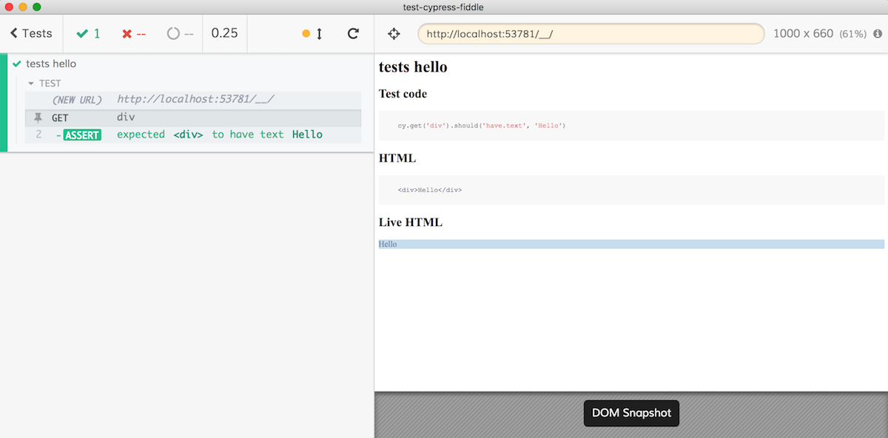
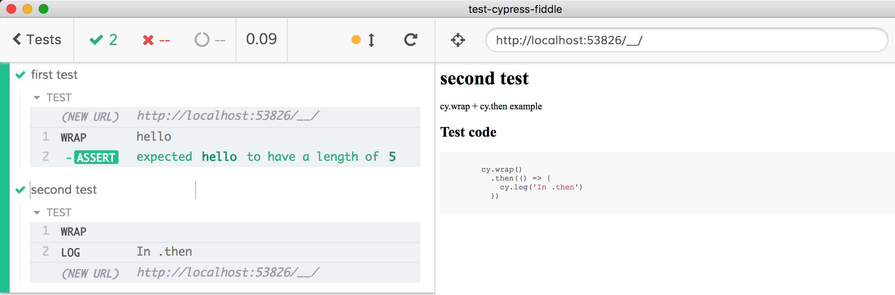
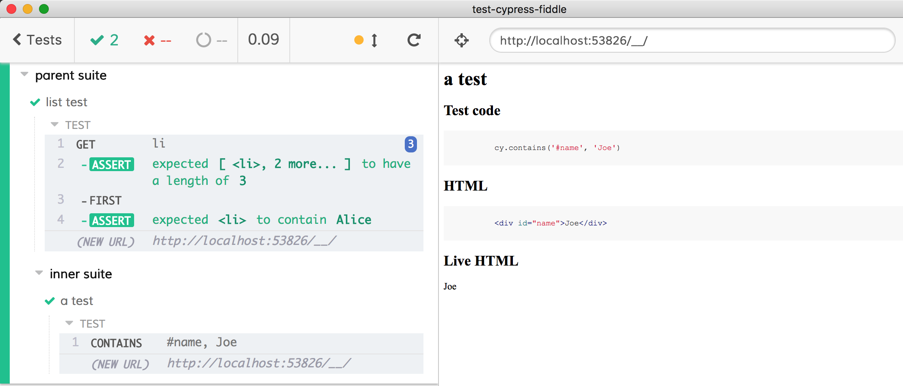
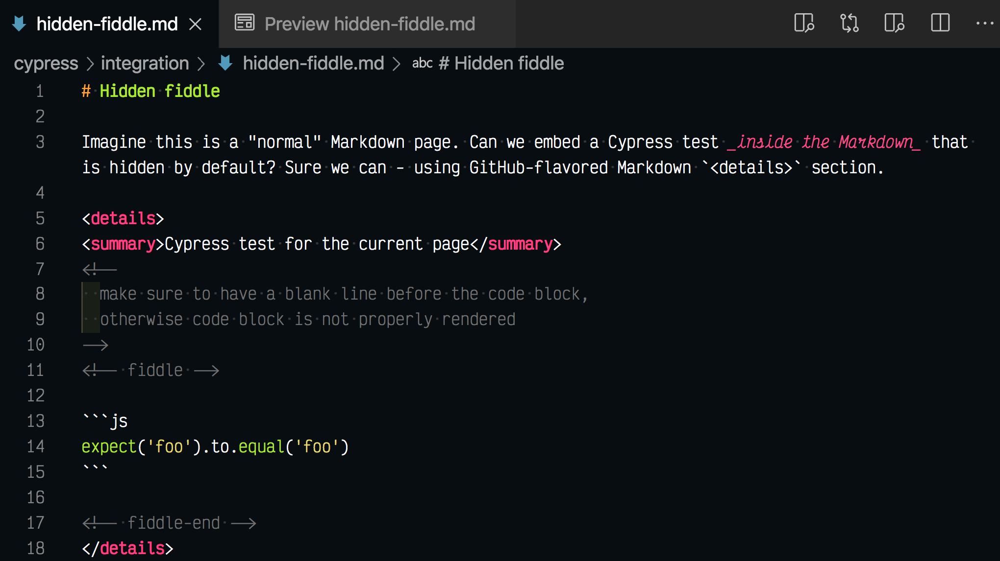
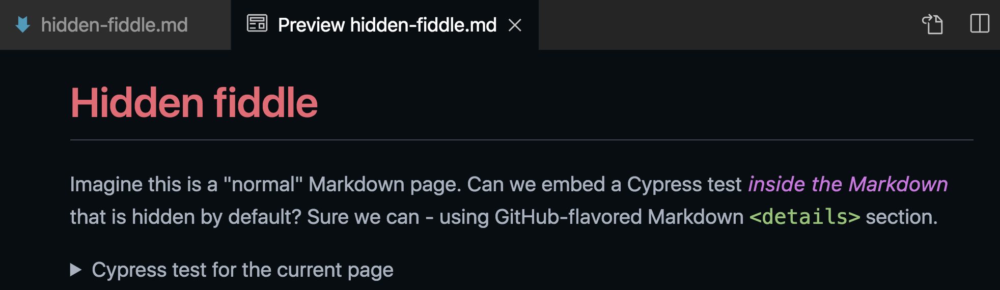
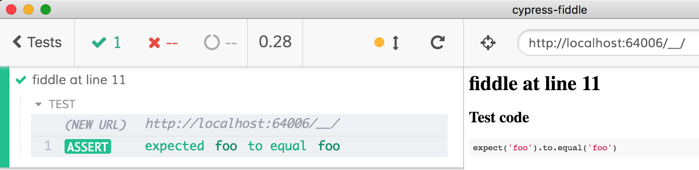

# cypress-fiddle [![renovate-app badge][renovate-badge]][renovate-app] [](https://circleci.com/gh/cypress-io/cypress-fiddle/tree/master)
> Generate Cypress tests live from HTML and JS

Instantly experiment with Cypress tests by creating a tiny live HTML fiddle and running E2E tests against it.



## Install

Cypress is a peer dependency of this module. Install the current version of Cypress by running `npm i -D cypress`.

After installing Cypress, install this module via npm:

```shell
npm i -D @cypress/fiddle
```

Then load the custom command by adding the following line to `cypress/support/index.js`

```js
// adds "cy.runExample()" command
import '@cypress/fiddle'
```

## Use

### Create a single test

You can take an object with an `html` property containing HTML and a `test` property containing Cypress commands and run the tests.

For example in the `cypress/integration/spec.js` file:

```js
// loads TypeScript definition for Cypress
// and "cy.runExample" custom command
/// <reference types="@cypress/fiddle" />

const helloTest = {
  html: `
    <div>Hello</div>
  `,
  test: `
    cy.get('div').should('have.text', 'Hello')
  `
}

it('tests hello', () => {
  cy.runExample(helloTest)
})
```

Which produces


### Parameters

The test object can have multiple properties, see [src/index.d.ts](src/index.d.ts) for all.

- `test` JavaScript with Cypress commands, required

The rest of the properties are optional

- `html` to mount as DOM nodes before the test begins
- `name` the name to display at the top of the page, otherwise the test title will be used
- `description` extra test description under the name, supports Markdown via [safe-marked](https://github.com/azu/safe-marked)

The next properties are NOT used by `cy.runExample` but are used by the `testExamples` function from this package.

- `skip` creates a skipped test with `it.skip`
- `only` creates an exclusive test with `it.only`

### Create multiple tests

Instead of writing the `cy.runExample()` command one by one, you can collect all test definitions into a list or a nested object of suites and create tests automatically.

For example, here is a list of tests created from an array:

```js
import { testExamples } from '@cypress/fiddle'

const tests = [
  {
    name: 'first test',
    description: 'cy.wrap() example',
    test: `
      cy.wrap('hello').should('have.length', 5)
    `
  },
  {
    name: 'second test',
    description: 'cy.wrap() + .then() example',
    test: `
        cy.wrap()
          .then(() => {
            cy.log('In .then')
          })
      `
  }
]
testExamples(tests)
```



While working with tests, you can skip a test or make it exclusive. For example to skip the first test add a `skip: true` property.

```js
{
  name: 'first test',
  description: 'cy.wrap example',
  skip: true
  ...
}
```

Or run just a single test by using the `only: true` property.

```js
{
  name: 'first test',
  description: 'cy.wrap example',
  only: true
  ...
}
```

You can create suites by having nested objects. Each object becomes either a suite or a test.

```js
import { testExamples } from '@cypress/fiddle'
const suite = {
  'parent suite': {
    'inner suite': [
      {
        name: 'a test',
        html: `
          <div id="name">Joe</div>
        `,
        test: `
          cy.contains('#name', 'Joe')
        `
      }
    ],
    'list test': {
      html: `
        <ul>
          <li>Alice</li>
          <li>Bob</li>
          <li>Cory</li>
        </ul>
      `,
      test: `
        cy.get('li').should('have.length', 3)
          .first().should('contain', 'Alice')
      `
    }
  }
}

testExamples(suite)
```



Find more examples in [cypress/integration](cypress/integration) folder.


### Markdown

This package includes a JS/CoffeeScript/Markdown preprocessor that can find and run tests in `.md` files. Just surround the tests with HTML comments like this:

    <!-- fiddle Test name here -->
    Add additional text if you want. HTML code block is optional.

    ```html
    <div>Example</div>
    ```

    Test code block that should be run as a test
    ```js
    cy.contains('Bye').should('be.visible')
    ```
    <!-- fiddle-end -->

See example [bahmutov/vuepress-cypress-test-example](https://github.com/bahmutov/vuepress-cypress-test-example) and [live site](https://vuepress-cypress-test-example.netlify.com/).

### Hiding fiddle in Markdown

You can "hide" fiddle inside Markdown so the page _can test itself_. See [cypress/integration/hidden-fiddle.md](cypress/integration/hidden-fiddle.md) example.

**Markdown**



**Rendered page**



Notice how only the summary is displayed

**Test runner**



**Note:** by default the summary element is displayed in the HTML. You can the fiddle completely using
```html
<details style="display:none">
 ...
</details>
```

#### Installation

In your plugins file use

```js
const mdPreprocessor = require('@cypress/fiddle/src/markdown-preprocessor')
module.exports = (on, config) => {
  on('file:preprocessor', mdPreprocessor)
}
```

And in `cypress.json` file allow Markdown files

```json
{
  "testFiles": "*.md"
}
```

Warning: [issue #5401](https://github.com/cypress-io/cypress/issues/5401)

## Debug

To see debug logs, use `DEBUG=@cypress/fiddle` when running Cypress.

## Publishing

Automatic semantic release on CircleCI using [Cypress Circle Orb](https://github.com/cypress-io/circleci-orb), see [circle.yml](circle.yml) file.

[renovate-badge]: https://img.shields.io/badge/renovate-app-blue.svg
[renovate-app]: https://renovateapp.com/
