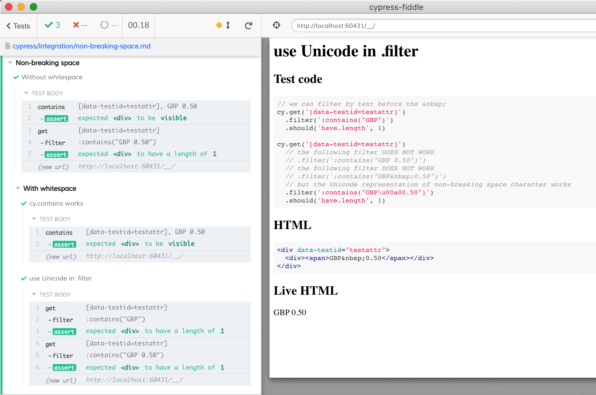

# Non-breaking space

Dealing with `&nbsp;` character aka [Non-breaking space](https://en.wikipedia.org/wiki/Non-breaking_space).

When using [cy.contains](https://on.cypress.io/contains) command Cypress automatically converts the `&nbsp;` entity into space character. Thus `cy.contains` finds element that include `&nbsp;`.

<!-- fiddle Without whitespace -->
```html
<div data-testid="testattr">
  <div><span>GBP 0.50</span></div>
</div>
```

```js
// both commands work
cy.contains ('[data-testid=testattr]', 'GBP 0.50').should('be.visible')
cy.get('[data-testid=testattr]')
  .filter(':contains("GBP 0.50")')
  .should('have.length', 1)
```
<!-- fiddle-end -->

But if the HTML contains the whitespace special character `&nbsp;` then checking elements by text is tricky. See [#9530](https://github.com/cypress-io/cypress/issues/9530) for example. This is because [.filter](https://on.cypress.io/filter) uses jQuery [:contains selector](https://api.jquery.com/contains-selector/) which uses literal text match.

<!-- fiddle With whitespace / cy.contains works -->
```html
<div data-testid="testattr">
  <div><span>GBP&nbsp;0.50</span></div>
</div>
```

```js
cy.contains ('[data-testid=testattr]', 'GBP 0.50').should('be.visible')
```
<!-- fiddle-end -->

<!-- fiddle With whitespace / use Unicode in .filter -->
```html
<div data-testid="testattr">
  <div><span>GBP&nbsp;0.50</span></div>
</div>
```

```js
// we can filter by text before the &nbsp;
cy.get('[data-testid=testattr]')
  .filter(':contains("GBP")')
  .should('have.length', 1)

cy.get('[data-testid=testattr]')
  // the following filter DOES NOT WORK
  // .filter(':contains("GBP 0.50")')
  // the following filter DOES NOT WORK
  // .filter(':contains("GBP&nbsp;0.50")')
  // but the Unicode representation of non-breaking space character works
  .filter(':contains("GBP\u00a00.50")')
  .should('have.length', 1)
```
<!-- fiddle-end -->

## Result


